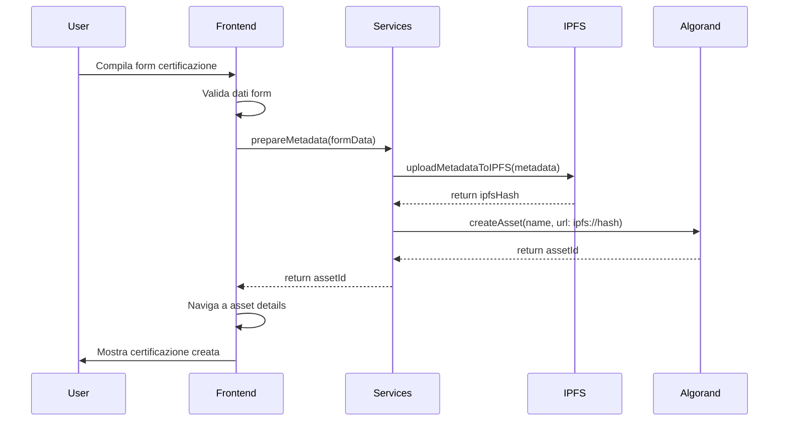
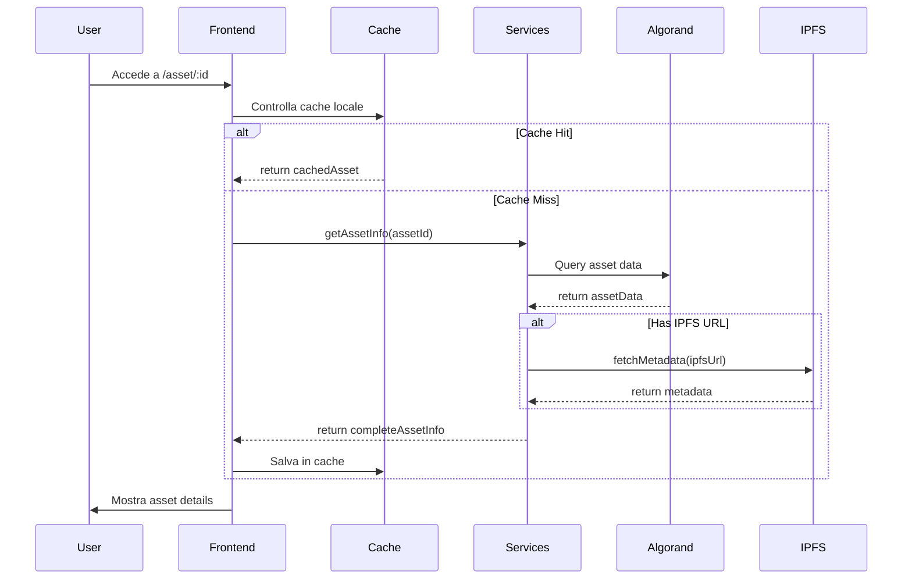
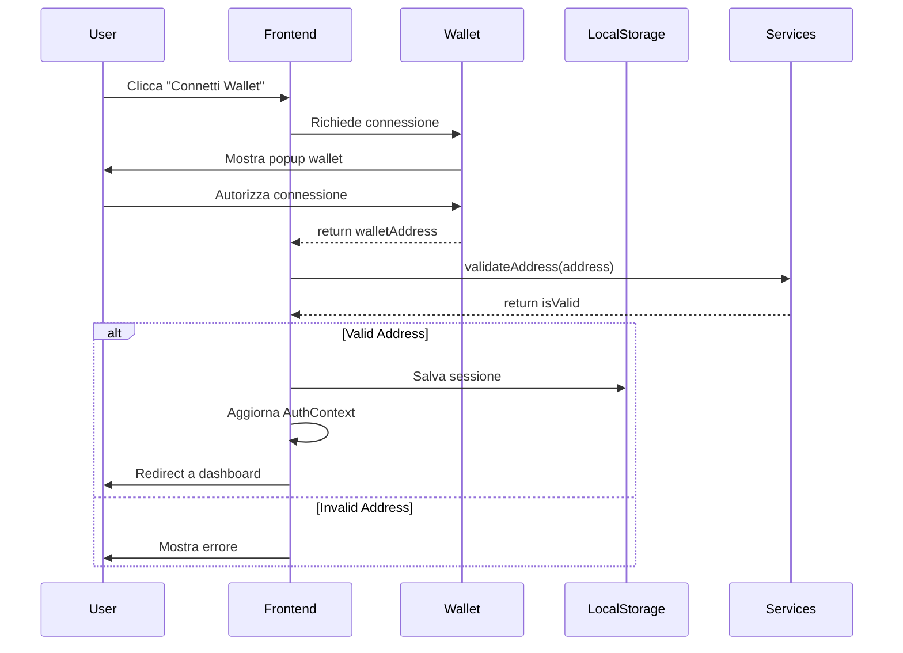

# 🏗️ Architettura Caput Mundi FE

Documentazione completa dell'architettura dell'applicazione Caput Mundi Frontend, inclusi pattern architetturali, flussi di dati e implementazione blockchain.

## 📋 Panoramica

Caput Mundi FE è una Single Page Application (SPA) React che implementa un sistema completo di certificazione digitale basato su blockchain Algorand con storage decentralizzato IPFS e compliance ARC-19 + ARC-3.

### Stack Tecnologico

```
Frontend:
├── React 19 + TypeScript    # Framework UI
├── Vite                     # Build tool
├── Tailwind CSS            # Styling
├── React Router           # Routing
└── Heroicons             # Iconografia

Blockchain:
├── Algorand SDK          # Blockchain integration
├── AlgoSigner/Pera      # Wallet integration
└── Indexer API          # Data querying

Storage:
├── IPFS + Pinata        # Metadata storage
├── LocalStorage         # Client persistence
└── Browser Cache       # Performance

Services (Implementati):
├── IPFSService          # Pinata integration completa
├── NFTMintingService    # ARC-19 + ARC-3 minting
├── AlgorandService      # Blockchain integration
├── NFTService          # Asset management
├── WalletService       # Wallet management
├── CidDecoder          # ARC-19 compliance
└── SPIDService         # Identity management
```

## 🏛️ Architettura Generale

### High-Level Architecture

```
┌─────────────────────────────────────────────────────────────┐
│                    FRONTEND (React SPA)                     │
├─────────────────────────────────────────────────────────────┤
│  Presentation Layer                                         │
│  ├── Pages (Dashboard, Wallet, Assets, etc.)              │
│  ├── Components (UI System, Forms, Modals)                │
│  └── Layout (ResponsiveLayout, Navigation)                │
├─────────────────────────────────────────────────────────────┤
│  Business Logic Layer                                       │
│  ├── Contexts (Auth, Theme, Settings)                     │
│  ├── Custom Hooks (useAsyncState, useDebounce)            │
│  └── Utils (Validation, Formatting, Helpers)             │
├─────────────────────────────────────────────────────────────┤
│  Data Layer                                                 │
│  ├── Services (Algorand, NFT, Wallet, IPFS)              │
│  ├── API Clients (HTTP, WebSocket)                        │
│  └── Local Storage (Preferences, Cache, Session)         │
└─────────────────────────────────────────────────────────────┘
                              │
                              ▼
┌─────────────────────────────────────────────────────────────┐
│                    EXTERNAL SERVICES                        │
├─────────────────────────────────────────────────────────────┤
│  Blockchain Layer                                          │
│  ├── Algorand Network (TestNet/MainNet)                   │
│  ├── Algod API (Transaction submission)                   │
│  └── Indexer API (Data querying)                          │
├─────────────────────────────────────────────────────────────┤
│  Storage Layer                                             │
│  ├── IPFS Network (Decentralized storage)                 │
│  ├── Pinata Gateway (IPFS access)                         │
│  └── Pinata API (File pinning)                            │
├─────────────────────────────────────────────────────────────┤
│  Identity Layer                                            │
│  ├── SPID Integration (Future)                            │
│  ├── Wallet Connect                                       │
│  └── AlgoSigner/Pera Wallet                              │
└─────────────────────────────────────────────────────────────┘
```

## 🔄 Flussi di Dati

### Flusso Creazione Certificazione



### Flusso Visualizzazione Asset



### Flusso Autenticazione



## 📁 Struttura Modulare

### Organizzazione Componenti

```
src/components/
├── ui/                     # Design System (Atomic Design)
│   ├── atoms/             # Componenti base (Button, Input)
│   ├── molecules/         # Combinazioni (SearchBox, Card)
│   ├── organisms/         # Sezioni complesse (Header, Sidebar)
│   └── templates/         # Layout pagine
│
├── pages/                 # Page Components (Route-level)
│   ├── DashboardPage/     # Dashboard con sottosezioni
│   ├── WalletPage/        # Gestione wallet
│   ├── AssetDetailsPage/  # Dettagli asset
│   └── forms/             # Form dedicati
│
├── features/              # Feature-based organization
│   ├── certification/     # Logica certificazioni
│   ├── wallet/           # Logica wallet
│   ├── assets/           # Logica asset
│   └── organization/     # Logica organizzazione
│
└── shared/               # Componenti condivisi
    ├── layout/           # Layout components
    ├── navigation/       # Navigation components
    └── modals/          # Modal components
```

### Gestione Stato

```typescript
// Context Pattern per stato globale
interface AppState {
  auth: AuthState;
  theme: ThemeState;
  preferences: UserPreferences;
}

// Local State per componenti
const useComponentState = () => {
  const [localState, setLocalState] = useState();
  // Logica locale
};

// Async State per operazioni remote
const useAsyncOperation = () => {
  const { data, loading, error, execute } = useAsyncState();
  // Gestione asincrona
};
```

## 🔌 Pattern di Integrazione

### Service Layer Pattern

```typescript
// Interfaccia servizio
interface AlgorandService {
  getAssetInfo(assetId: number): Promise<AssetInfo>;
  createAsset(params: AssetParams): Promise<number>;
  getAccountInfo(address: string): Promise<AccountInfo>;
}

// Implementazione concreta
class AlgorandServiceImpl implements AlgorandService {
  private algodClient: Algodv2;
  private indexerClient: Indexer;

  async getAssetInfo(assetId: number): Promise<AssetInfo> {
    // Implementazione specifica
  }
}

// Dependency Injection
const algorandService = new AlgorandServiceImpl();
export { algorandService };
```

### Repository Pattern

```typescript
// Repository per cache locale
interface AssetRepository {
  get(id: string): Promise<AssetInfo | null>;
  set(id: string, asset: AssetInfo): Promise<void>;
  invalidate(id: string): Promise<void>;
}

class LocalStorageAssetRepository implements AssetRepository {
  async get(id: string): Promise<AssetInfo | null> {
    const cached = localStorage.getItem(`asset_${id}`);
    if (!cached) return null;
    
    const { data, timestamp } = JSON.parse(cached);
    if (Date.now() - timestamp > CACHE_TTL) {
      await this.invalidate(id);
      return null;
    }
    
    return data;
  }
}
```

### Factory Pattern

```typescript
// Factory per creare servizi
class ServiceFactory {
  static createAlgorandService(network: 'testnet' | 'mainnet'): AlgorandService {
    const config = getNetworkConfig(network);
    return new AlgorandServiceImpl(config);
  }

  static createIPFSService(gateway: string): IPFSService {
    return new IPFSServiceImpl(gateway);
  }
}
```

## 🚀 Performance Patterns

### Code Splitting

```typescript
// Lazy loading delle pagine
const DashboardPage = lazy(() => import('./pages/DashboardPage'));
const WalletPage = lazy(() => import('./pages/WalletPage'));
const AssetDetailsPage = lazy(() => import('./pages/AssetDetailsPage'));

// Route-based splitting
const AppRoutes = () => (
  <Suspense fallback={<LoadingSpinner />}>
    <Routes>
      <Route path="/" element={<DashboardPage />} />
      <Route path="/wallet" element={<WalletPage />} />
      <Route path="/asset/:id" element={<AssetDetailsPage />} />
    </Routes>
  </Suspense>
);
```

### Memoization Strategy

```typescript
// Memoizzazione componenti costosi
const ExpensiveComponent = memo(({ data }: Props) => {
  const processedData = useMemo(() => {
    return expensiveCalculation(data);
  }, [data]);

  return <div>{processedData}</div>;
});

// Callback memoization
const ParentComponent = () => {
  const handleClick = useCallback((id: string) => {
    // Handle click
  }, []);

  return <ChildComponent onClick={handleClick} />;
};
```

### Caching Strategy

```typescript
// Multi-level caching
class CacheManager {
  private memoryCache = new Map();
  private localStorageCache = new LocalStorageCache();
  
  async get(key: string): Promise<any> {
    // 1. Memory cache (fastest)
    if (this.memoryCache.has(key)) {
      return this.memoryCache.get(key);
    }
    
    // 2. LocalStorage cache
    const cached = await this.localStorageCache.get(key);
    if (cached) {
      this.memoryCache.set(key, cached);
      return cached;
    }
    
    // 3. Network (slowest)
    return null;
  }
}
```

## 🔒 Security Architecture

### Input Validation

```typescript
// Schema validation
const assetIdSchema = z.number().int().positive();
const addressSchema = z.string().length(58).regex(/^[A-Z2-7]+$/);

// Runtime validation
const validateAssetId = (id: unknown): number => {
  return assetIdSchema.parse(id);
};

// Sanitization
const sanitizeInput = (input: string): string => {
  return input.replace(/<script\b[^<]*(?:(?!<\/script>)<[^<]*)*<\/script>/gi, '');
};
```

### Error Boundaries

```typescript
class ErrorBoundary extends Component<Props, State> {
  constructor(props: Props) {
    super(props);
    this.state = { hasError: false };
  }

  static getDerivedStateFromError(error: Error): State {
    return { hasError: true };
  }

  componentDidCatch(error: Error, errorInfo: ErrorInfo) {
    // Log errore a servizio monitoring
    console.error('Error boundary caught an error:', error, errorInfo);
  }

  render() {
    if (this.state.hasError) {
      return <ErrorFallback />;
    }

    return this.props.children;
  }
}
```

### Content Security Policy

```typescript
// CSP Headers (da configurare nel server)
const cspDirectives = {
  'default-src': ["'self'"],
  'script-src': ["'self'", "'unsafe-inline'", 'https://cdn.jsdelivr.net'],
  'style-src': ["'self'", "'unsafe-inline'", 'https://fonts.googleapis.com'],
  'img-src': ["'self'", 'data:', 'https://*.pinata.cloud'],
  'connect-src': ["'self'", 'https://*.algonode.cloud', 'https://*.pinata.cloud'],
  'font-src': ["'self'", 'https://fonts.gstatic.com']
};
```

## 📊 Monitoring & Analytics

### Error Tracking

```typescript
// Error tracking service
class ErrorTracker {
  static track(error: Error, context?: any) {
    const errorData = {
      message: error.message,
      stack: error.stack,
      timestamp: new Date().toISOString(),
      url: window.location.href,
      userAgent: navigator.userAgent,
      context
    };

    // Invia a servizio monitoring
    this.sendToMonitoring(errorData);
  }

  private static sendToMonitoring(data: any) {
    // Implementazione invio errori
  }
}
```

### Performance Monitoring

```typescript
// Performance tracking
class PerformanceTracker {
  static measureOperation<T>(
    name: string,
    operation: () => Promise<T>
  ): Promise<T> {
    const start = performance.now();
    
    return operation().finally(() => {
      const duration = performance.now() - start;
      this.trackMetric(name, duration);
    });
  }

  private static trackMetric(name: string, value: number) {
    // Invia metrica a analytics
  }
}
```

## 🧪 Testing Architecture

### Testing Strategy

```typescript
// Unit Tests - Componenti isolati
describe('Button Component', () => {
  it('should render with correct variant', () => {
    render(<Button variant="primary">Test</Button>);
    expect(screen.getByRole('button')).toHaveClass('bg-blue-600');
  });
});

// Integration Tests - Flussi completi
describe('Asset Creation Flow', () => {
  it('should create asset successfully', async () => {
    const mockService = jest.mocked(algorandService);
    mockService.createAsset.mockResolvedValue(123);
    
    render(<AssetCreationForm />);
    // Test flusso completo
  });
});

// E2E Tests - User journeys
describe('User Journey', () => {
  it('should complete certification process', () => {
    cy.visit('/dashboard');
    cy.get('[data-testid="create-certification"]').click();
    // Test end-to-end
  });
});
```

### Mock Strategy

```typescript
// Service mocks
export const mockAlgorandService = {
  getAssetInfo: jest.fn(),
  createAsset: jest.fn(),
  getAccountInfo: jest.fn()
};

// MSW per API mocking
const handlers = [
  rest.get('/api/assets/:id', (req, res, ctx) => {
    return res(ctx.json({ id: req.params.id, name: 'Test Asset' }));
  })
];
```

## 🔄 Deployment Architecture

### Build Process

```typescript
// Vite configuration
export default defineConfig({
  build: {
    rollupOptions: {
      output: {
        manualChunks: {
          vendor: ['react', 'react-dom'],
          algorand: ['algosdk'],
          ui: ['@heroicons/react']
        }
      }
    }
  },
  define: {
    __BUILD_TIME__: JSON.stringify(new Date().toISOString())
  }
});
```

### Environment Management

```typescript
// Environment configuration
interface EnvironmentConfig {
  algorand: {
    network: 'testnet' | 'mainnet';
    algodServer: string;
    indexerServer: string;
  };
  ipfs: {
    gateway: string;
  };
  features: {
    spidIntegration: boolean;
    analytics: boolean;
  };
}

const getConfig = (): EnvironmentConfig => {
  return {
    algorand: {
      network: import.meta.env.VITE_ALGORAND_NETWORK,
      algodServer: import.meta.env.VITE_ALGOD_SERVER,
      indexerServer: import.meta.env.VITE_INDEXER_SERVER
    },
    ipfs: {
      gateway: import.meta.env.VITE_PINATA_GATEWAY
    },
    features: {
      spidIntegration: import.meta.env.VITE_ENABLE_SPID === 'true',
      analytics: import.meta.env.VITE_ENABLE_ANALYTICS === 'true'
    }
  };
};
```

## 📈 Scalability Considerations

### Horizontal Scaling

- **CDN**: Assets statici serviti da CDN
- **Load Balancing**: Multiple istanze frontend
- **API Gateway**: Rate limiting e caching
- **Microservices**: Servizi backend separati

### Vertical Scaling

- **Bundle Optimization**: Code splitting e tree shaking
- **Memory Management**: Cleanup automatico e garbage collection
- **CPU Optimization**: Lazy loading e virtualization
- **Network Optimization**: Compression e caching

### Future Architecture

```
┌─────────────────────────────────────────────────────────────┐
│                    FUTURE ENHANCEMENTS                      │
├─────────────────────────────────────────────────────────────┤
│  ├── PWA Support (Service Workers, Offline)               │
│  ├── Real-time Updates (WebSocket, SSE)                   │
│  ├── Multi-language Support (i18n)                        │
│  ├── Advanced Analytics (User behavior tracking)          │
│  ├── Notification System (Push notifications)             │
│  ├── Advanced Caching (Redis, CDN)                        │
│  └── Microservices (Separate backend services)            │
└─────────────────────────────────────────────────────────────┘
```

---

**Architettura completa per ArtCertify - Scalabile, sicura e manutenibile** 